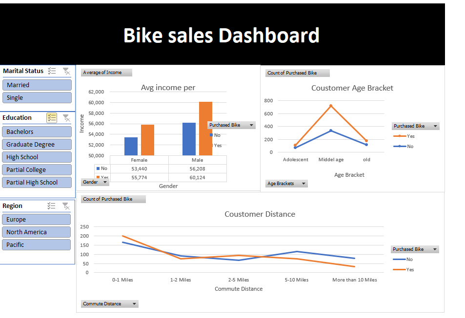

# Bike Sales Excel Dashboard

Interactive Excel dashboard analyzing bike sales data using pivot tables, charts, and slicers.

## Dashboard Preview

## Tools Used
- Microsoft Excel
- Pivot Tables
- Pivot Charts
- Slicers

## Key Insights
- Middle-aged customers purchase bikes more frequently
- Customers with higher income are more likely to buy bikes
- Purchase decreases as commute distance increases
